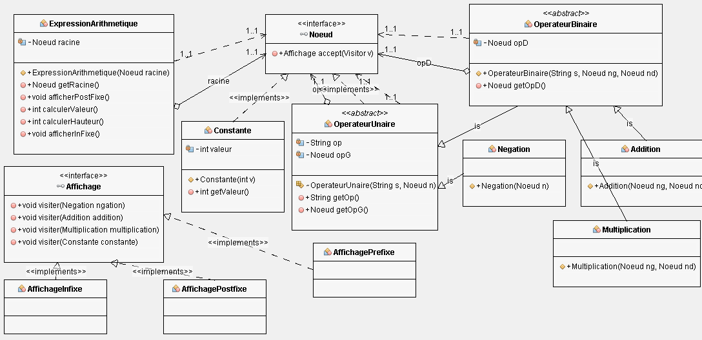

**Bertrand/Axel**

**Bontron/Julien**

# Rapport TP2

## Question 1
Voici le diagramme UML de notre projet afin d'utiliser le pattern Visitor.

## Question 2
Afin de mettre en place le pattern Visitor dans notre projet, nous avons en place une interface appellée Affichage qui permet de visiter
les différents types de noeuds de l'arbre. Elle permet de définir les différents variantes de la fonction visit qui permet de parcourir les 
constantes, les négations, les additions et les multiplications. Ces méthodes seront redefinis pour les implémenter les différents parcours que 
nous devons effectuer lors de ce TP.

## Question 3
Pour le parcours postfixe, on affiche en premier la valeur des constantes des différents noeuds puis on affiche celle des opérateurs pour chaque branche.

## Question 4
*Expliquer le code ajouté*

## Question 5
*Expliquer le code ajouté*

## Question 6
Pour le parcours infixe, pour un opérteur binaire on affiche d'abord la branche de gauche puis l'opérateur puis la branche de droite pour un 
opérateur binaire, on affiche d'abord l'opérateur puis la valeur de la branche. 